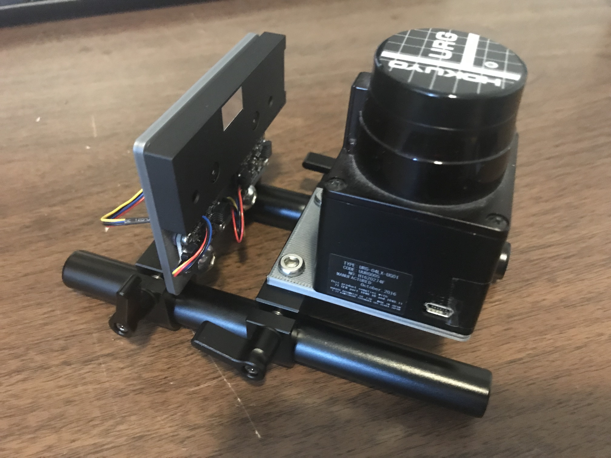

# Mechanical

These brackets mount the stereo camera and inertial sensors (accel, gyro, and pressure) and a lidar. The version shown above doesn't allow the camera and 
lidar to operate simulatinously. But you can do:

- camera bracket:
    - EX8029 stereo camera
    - LSM6DSOX accel/gyro
    - LIS3MDL magnetometer
    - BMP390 pressure
- lidar bracket:
    - URG-04LX
